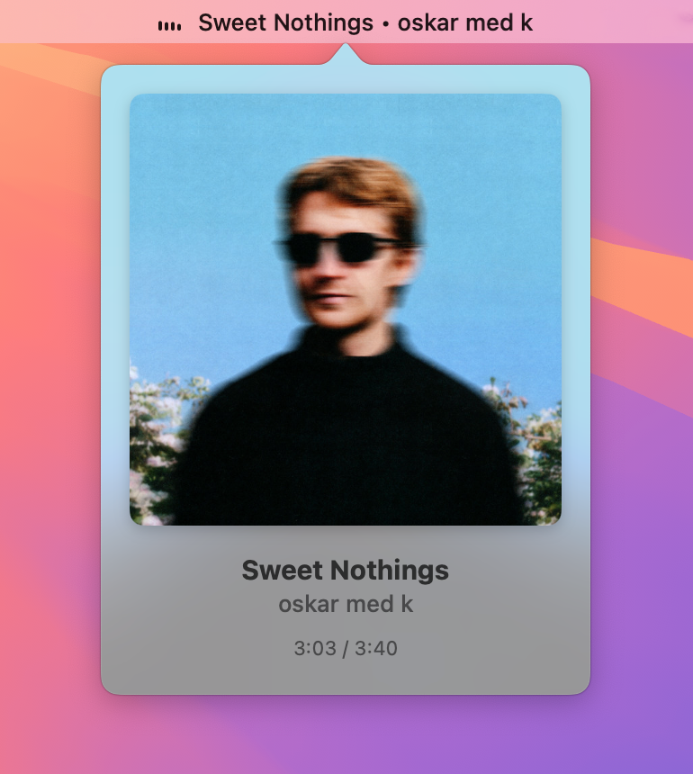
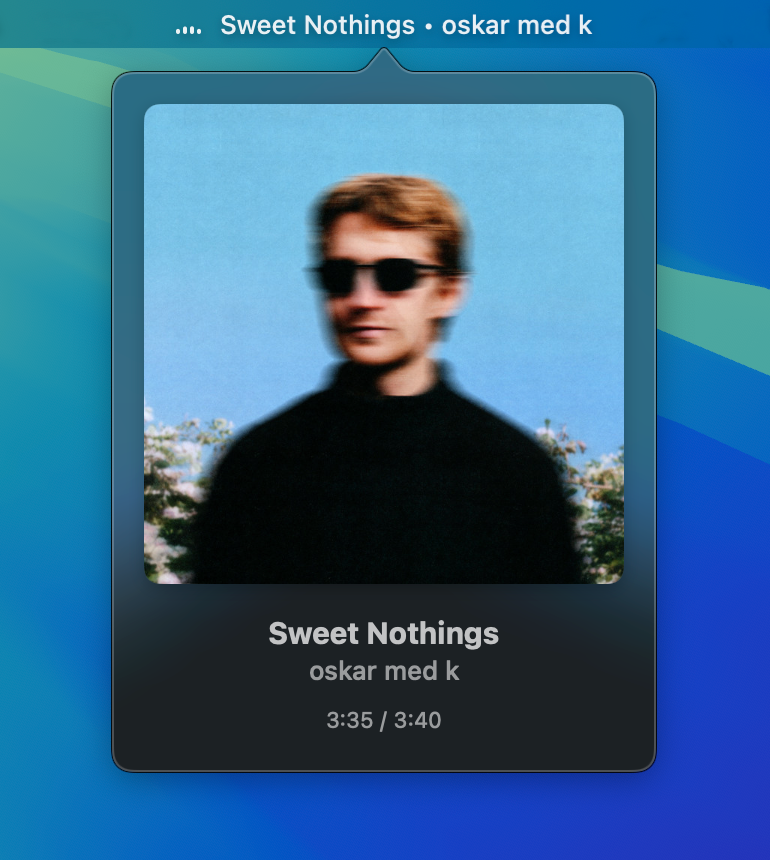
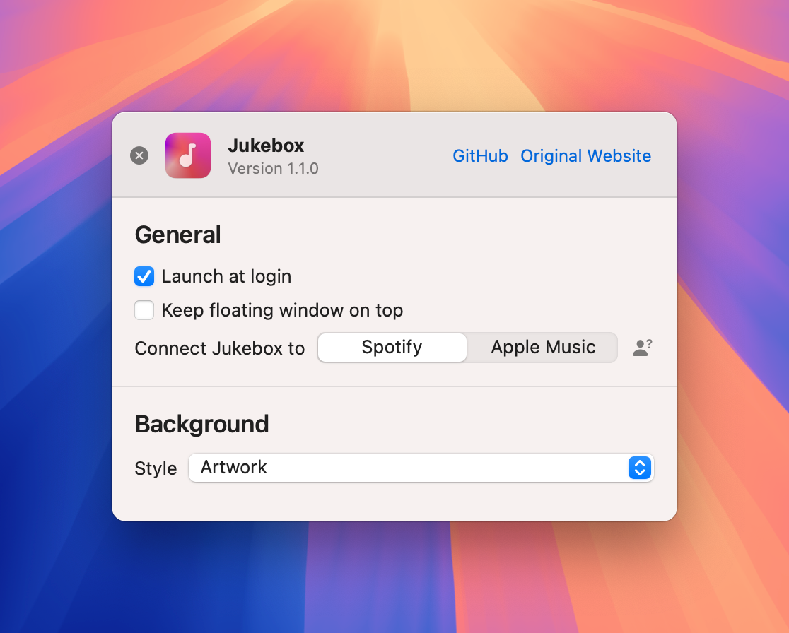

# Jukebox

A macOS menu bar app for displaying and controlling the currently playing song from Spotify or Apple Music.

 

**Requires macOS 13 Ventura or later.**

## Install

[Download the latest release](https://github.com/jaydenk/Jukebox/releases/latest)

Jukebox checks for updates automatically via Sparkle.

## Usage

  
  

The app shows the currently playing song in the menu bar with an animated playback indicator and a progress line showing elapsed time. Clicking the menu bar item will present a window displaying details of the current track. Hovering over the album art gives you controls.

You can also pin the now playing view as a floating window that stays visible while you work, with an optional always-on-top mode.

  

The preferences menu can be opened by right clicking the menu bar item.
From here you can change which app Jukebox gets music data from and the background that appears behind the album art.
Clicking the button next to the connect option gives you the prompt to connect the music app you choose.

## Changelog

### v1.3.0

- **Resizable floating window** — drag any edge to resize the pinned now playing window; it stays square and remembers its size as well as its position
- **Right-click menu** — right-click the floating window to unpin, toggle "keep on top", open preferences, or quit (the hover pin button has been removed)
- **Seek from the floating window** — hover to reveal a progress bar you can click or drag to scrub, now working for both Spotify and Apple Music

### v1.2.1

- **Apple Music seek sync** — the menu bar progress line now follows seeks and scrubs on Apple Music tracks, including local files. Previously it would freeze at the old position until the next track, because Apple Music does not broadcast a notification when a local track is seeked
- **Album art for art-less tracks** — a track with no artwork no longer keeps showing the previously playing track's cover
- **Under the hood** — fixed the now playing view model being initialised twice, which was doubling background queries to the music app

### v1.2.0

- **Playback progress indicator** — a progress line below the menu bar icon shows elapsed track time, advancing in real-time during playback and freezing when paused
- **Disable animations** — new preference to disable bar oscillation and text scrolling for a quieter menu bar
- **Show playback progress toggle** — choose whether to display the progress line in preferences

### v1.1.0

- **Floating now playing window** — pin the now playing view as a floating window that stays visible while you work, with optional always-on-top mode and position memory
- **Improved multi-monitor support** — status bar icon and text now correctly fade on inactive screens, matching standard macOS behaviour
- **Three-state playback indicator** — animated bars when playing, pause icon when paused, stop icon when the music source is closed
- **Automatic updates** — Jukebox now checks for updates via Sparkle
- **Bug fixes** — fixed animation continuing after the music source was stopped or closed

### v1.0.1

- 30-second delay before hiding track info after pausing
- Launch at login support via LaunchAtLogin-Modern

## Debug logging

If you hit a problem (for example, missing album art), you can capture logs to send along
with a bug report:

1. Open **Preferences ▸ Debugging** and turn on **Enable debug logging**.
2. Reproduce the problem (e.g. play the track whose artwork is missing).
3. Click **Export Logs…**. Jukebox writes a `Jukebox-Diagnostics-<timestamp>.txt` file and
   reveals it in Finder.
4. Attach that file to your GitHub issue or email.

The log is stored locally at
`~/Library/Application Support/Jukebox/Logs/Jukebox.log` and is never sent anywhere unless
you export and share it. It includes the names of tracks played while logging was enabled.

## Attributions

- [Sparkle](https://sparkle-project.org) for update delivery
- [LaunchAtLogin-Modern](https://github.com/sindresorhus/LaunchAtLogin-Modern)
- Basewarp shader by [trinketMage](https://www.shadertoy.com/view/tdG3Rd)
